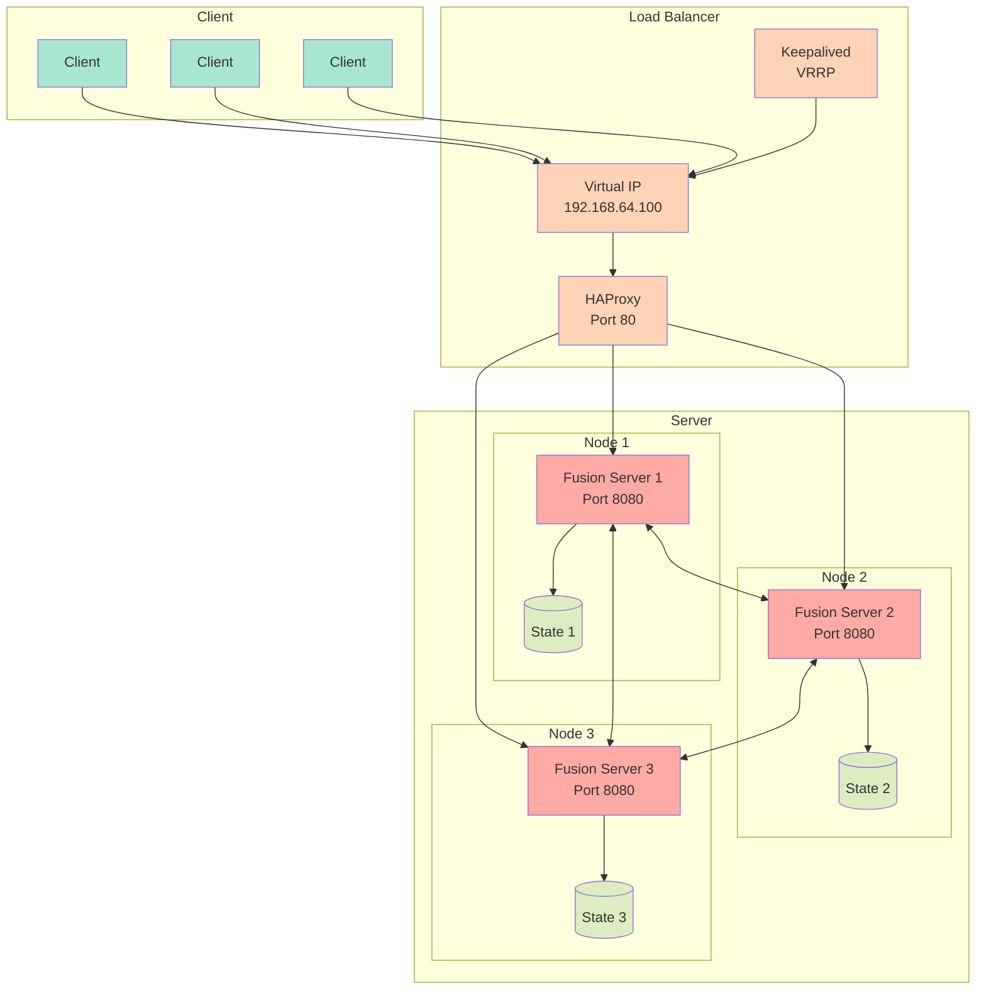

# Fusion Server-trigger

Fusion Server is a distributed configuration management system with high availability features, built using Go. It provides configuration synchronization across multiple nodes with support for load balancing and failover.

## Features

- Distributed configuration storage with real-time synchronization
- High availability with HAProxy load balancing and Keepalived failover
- REST API for configuration management
- WebSocket support for streaming updates
- Unix Domain sockets for inter-network communication
- State persistence and recovery
- JSON import/export functionality
- Metrics monitoring and debug capabilities
- Binary updating and rollback

## Architecture

### Components

1. **State Management**
   - Distributed state synchronization across nodes
   - Version-based conflict resolution
   - Persistent storage of configuration data
   - Timestamp-based tie-breaking
   - Real-time state synchronization
   - State verification and validation

2. **High Availability**
   - HAProxy load balancing across cluster nodes
   - Keepalived for VIP (Virtual IP) management
   - VRRP protocol for IP takeover
   - Automatic failover support
   - Dynamic backend server registration
   
3. **Networking**
   - Gossip-based cluster membership
   - REST API for configuration management
   - WebSocket and Unix socket connections for streaming updates
   - Unix Domain sockets for configuration management 
   - Metrics endpoints

### Configuration

   **HAProxy Configuration**
   - Automatically generated based on cluster membership
   - Default configuration includes:
     - HTTP mode
     - Round-robin load balancing
     - Health checks on /value endpoint
     - Configurable timeouts and connection limits

   **Keepalived Configuration**
   - Virtual IP (VIP): 192.168.64.100. The address to use is configurable in [multipass.env](multipass.env).
   - VRRP configuration for high availability
   - Automatic failover between nodes

   **Node Configuration**
   - Each node requires:
     - Unique node name
     - Bind address and port
     - Optional join address for cluster membership

### Dependencies

- [memberlist](github.com/hashicorp/memberlist) - Cluster membership and failure detection
- [websocket](github.com/gorilla/websocket) - WebSocket support
- [go](www.go.dev) - Standard Go libraries


## Setup

#### Multipass

[Multipass](https://multipass.run/) is used to create and manage Ubuntu VM instances for development and testing. It provides a quick way to spin up consistent Ubuntu environments across different platforms.

**macOS**
```bash
brew install --cask multipass
```

**Ubuntu**
```bash
sudo snap install multipass
```

**Windows**
- Download the installer from [Multipass website](https://multipass.run/download/windows)

## Installation

**Clone the repository and build the server**
```bash
git clone git@github.com:BoseProfessional/fusion-services.git
./build-fusion-server
```

## Usage
### Launch a single server instance using multipass
```bash
./scripts/multipass/launch
```

**Create multiple instances with default named "fusion"**
```bash
./scripts/multipass/launch --instances 3
```

### Stopping instances
**Stop instances with default name**
```bash
./scripts/multipass/launch --kill
```

**Stop multiple instances with prefix**
```bash
multipass stop fusion
```

**Stop instance with specific name**
```bash
multipass stop fusion1
```

### Launch a single server on local machine
**Build fusion-server for local machine**
```bash
make help
Make targets:
 all - Run deps, test, and build
 build - Build for current platform
 test - Run tests
 test-verbose - Run tests with verbose output and no caching
 clean - Clean build files
 run - Build and run locally
 deps - Download dependencies
 tidy - Tidy go.mod
 fmt - Format code
 vet - Run go vet
 lint - Run linter
 build-linux-amd64 - Build for Linux amd64
 build-linux-arm32 - Build for Linux ARM32
 build-linux-arm64 - Build for Linux ARM64
 build-darwin-arm64 - Build for macOS ARM64
 build-all - Build for all platforms

 make build-darwin-arm64
```

**Run binary built for local machine**
```bash
./build/fusion-server_darwin_arm64 --local
```

NOTE: Local builds don't support haproxy, keepalived or memberlist. You can ignore log output about issues related to this.
Local builds are good for developing the various server components without dealing with instance management.

**Build and Deploy Fusion-server binary to a device**
```bash
./scripts/remote_scripts/deploy-fusion-server-to-device.sh root@192.168.1.3
```
### API Endpoints

**Configuration Management**
   - `POST /value` - Set a configuration value
   - `GET /value` - Retrieve configuration value(s)
   - `GET /ws` - WebSocket endpoint for real-time updates

### Set a single value
This will set a single value.
```bash
curl -X POST http://192.168.64.100:8080/value \
  -H "Content-Type: application/json" \
  -d '{"key": "value"}'
```

### Set a nested configuration object
This will set multiple nested values. This call will not merge
any existing values, so use caution.
```bash
curl -X POST http://192.168.64.100:8080/value \
  -H "Content-Type: application/json" \
  -d '{
    "volume" : {
      "min": "0.0",
      "max": 1.0,
      "current": 0.5
    }
  }'
```

### Update a nested configuration object
This will update multiple nested values. Existing values will be merged.
If a value is set to null, it will be removed.
```bash
curl -X PATCH http://192.168.64.100:8080/value  \
  -H "Content-Type: application/json" \
  -d '{
    "settings": {
    "audio": {
      "tone_eq1" : {
        "low_gain": null,
        "high_gain": 10.0
      }
    }
  }
}' -H "Content-Type: application/json"
```
Result:
```bash
{
  "status": "success",
  "updates": {
    "settings": {
      "audio": {
        "tone_eq1": {
          "high_gain": 10
        }
      }
    }
  }
}
```

### Get a specific value
```bash
curl "http://192.168.64.100:8080/value?key=current"
```

Response if value exists:
```json
{
  "exists": true,
  "value": {
    "current": 0.5,
    "max": 1,
    "min": "0.0"
  }
}
```

Response if value does not exist:
```json
{
  "error": "key not found",
  "exists": false
}
```

### Get all configuration values
```bash
curl http://192.168.64.100:8080/value
```

### Download and save current configuration with specific filename
```bash
curl http://192.168.64.100:8080/value > backup_config.json
```

## Websockets

### Simple connection that prints received messages
```bash
websocat ws://192.168.64.100:8080/ws
```

### Connect with interactive mode to send and receive messages
```bash
websocat -v ws://192.168.64.100:8080/ws
```

## Unix Domain Sockets (UDP)
Unix Domain Sockets are used to communicate between server instances. 
The socket can only be accessed within the internal network.

### Get all values
From with server instance:
```bash
echo '{"action":"get"}' | nc -u -w 1 {vip} 7947
```

Outside of instance:
```bash
multipass exec fusion1 -- bash -c "echo '{\"action\":\"get\"}' | nc -u -w 1 -v localhost 7947"
```

### Set a value
```bash
echo '{"action":"set","payload":{"test":"hello"}}' | nc -u -w 1 {vip} 7947
```

Inside of instance:
```bash
multipass exec fusion1 -- bash -c "echo '{\"action\":\"set\",\"payload\":{\"test\":\"hello\"}}' | nc -u -w 1 localhost 7947"
```

### Set a nested value
```bash
echo '{
  "action":"set",
  "payload":{
    "settings":{
      "audio":{
        "volume":0.6
      }
    }
  }
}' | nc -u -w1 127.0.0.1 7947


```

### Set a value outside of instance
```bash
multipass exec fusion1 -- bash -c 'cat <<EOF | nc -u -w1 127.0.0.1 7947
{
  "action":"set",
  "payload":{
    "settings":{
      "audio":{
        "volume":0.6
      }
    }
  }
}
EOF'
```

## Updates

A new fusion-server binary can be pushed and propogated across all running instances.
  
There are endpoints for updating the binary and rolling back a binary.
  - `PUT /version` - Post a new binary to replace the running fusion-server instance.
  - `POST /version` - Rollback a binary a certain number of previous updates.


The curl command can also be used to call the endpoints from the command line.
```bash
shasum -a 256 build/fusion-server_linux_arm64 

curl -X POST \
  -F "binary=@your_server_binary" \
  -F "checksum=8d969eef6ecad3c29a3a629280e686cf0c3f5d5a86aff3ca12020c923adc6c92" \
  http://localhost:8080/version
```

The checksum of the new binary can be calculated as part of the curl command.
```bash
curl -X POST \
  -F "binary=@build/fusion-server_linux_arm64" \
  -F "checksum=$(shasum -a 256 build/fusion-server_linux_arm64  | cut -d ' ' -f 1)" \
  http://192.168.64.100:8080/version
```

## Basic Commands

1. **Create a new instance**
```bash
./scripts/multipass/launch
```

2. **List instances**
```bash
multipass list
```

3. **Start/Stop instances**
```bash
multipass stop fusion1
multipass start fusion1
```

4. **Access instance shell**
```bash
multipass shell fusion1
```

5. **Get instance information**
```bash
multipass info fusion1
```

6. **Mount local directory**
```bash
multipass mount /local/path fusion1:/home/ubuntu/mounted
```

7. **Delete instance**
```bash
multipass delete fusion1
multipass purge  # Remove deleted instances completely
```

#### Creating Multiple Nodes

For a three-node cluster setup:

```bash
# Create instances
./scripts/multipass/launch --instances 3

# Get IP addresses
multipass list

# Shell into instances
multipass shell fusion1
```

#### Useful Tips

1. **Transfer files to instance**
```bash
multipass transfer /local/file.txt fusion1:/home/ubuntu/
```

2. **Execute command in instance**
```bash
multipass exec fusion1 -- command
```

3. **View instance logs**
```bash
multipass exec fusion1 -- cat /var/log/cloud-init-output.log
multipass exec fusion1 -- sudo journalctl
multipass exec fusion1 -- sudo dmesg -w
multipass exec fusion1 -- sudo journalctl -u haproxy -f
multipass exec fusion1 -- sudo journalctl -u keepalived-server -f
multipass exec fusion1 -- sudo journalctl -u fusion-server -f
```
4. **Network configuration**
```bash
# Get instance IP address
multipass info fusion1 | grep IPv4
```

5. **Inspecting the database**
fusion-server uses bbolt, a key-value store to store configuration data.

To look at the current state of the database, you can run this command:
```bash
./scripts/inspect-config.sh fusion1 get state latest  | jq
```
This script is using the bbolt command, which is installed along with fusion-server.

You can use jq to further filter the json returned by the script like this:
```bash
./scripts/inspect-config.sh fusion1 get state latest | jq '.state.user_setting.data'
```

## Troubleshooting

1. **Instance fails to start**
   - Check cloud-init logs:
   ```bash
   multipass exec fusion1 -- cat /var/log/cloud-init-output.log
   ```
   - Verify resource availability on host machine
   - Ensure cloud-config.yaml is valid

2. **Network connectivity issues**
   - Verify host network connectivity
   - Check instance network status:
   ```bash
   multipass exec fusion1 -- ip addr
   ```
3. **systemd status**
```bash
multipass exec fusion1 -- systemctl status chrony
multipass exec fusion1 -- systemctl status haproxy
multipass exec fusion1 -- systemctl status keepalived
multipass exec fusion1 -- systemctl status fusion-server
```

4. **VIP Issues**
   - Check network interface configuration
   - Verify Keepalived status
   - Monitor VRRP advertisements

5. **Cluster Synchronization**
   - Check node connectivity
   - Verify gossip protocol communication
   - Monitor state version numbers
   - Check chrony status
    ```bash
    multipass exec fusion1 -- chronyc tracking
    ```

6. **Load Balancer Issues**
   - Check HAProxy configuration
   - Verify backend metrics
   - Monitor HAProxy logs

7. **Multipass instance launch fails on a Mac with M4 series chip**

   Error message:
   ```bash
   → Checking for existing instances...
   list failed: Unexpected error in object_property_find_err() at ../../../qom/object.c:1330:
   qemu-system-aarch64: Property 'host-arm-cpu.sme' not found
   ```
   
   Solution:
   
   Multipass has not yet released a version that resolves this issue on M4 Macs. In the meantime, you can install the package from this [workaround](https://github.com/canonical/multipass/issues/3842#issuecomment-2552189605).

8. **list failed: cannot connect to the multipass socket**
```bash
sudo launchctl load -w /Library/LaunchDaemons/com.canonical.multipassd.plist
sudo launchctl kickstart -k system/com.canonical.multipassd
```

## Testing

**Launch multiple instance**
```bash
./scripts/multipass/launch --instances 3
```
**Build and run test**
```bash
./scripts/multipass/run-tests
```
**Bruno**

Bruno is a free alternative to Postman and requires no account to use.

```bash
brew install bruno
```
- Launch /Applications/Bruno.app
- Import the Buron collection located at tools/api/fusion_api.json into Bruno
- Set the environmant to dev using the drop-down menu at the top-right of the Bruno window.


## Monitoring

**Metrics Server**
   - Available on port (default: 8080)
   - Endpoints:
     - `/metrics` - Complete system metrics
     - `/cluster/status` - Detailed cluster information
   - Metrics include:
     - Cluster health and membership
     - Configuration state statistics
     - System resource usage
     - Network connectivity
     - Process health

**Prometheus**
```bash
brew install prometheus
/opt/homebrew/bin/prometheus --config.file=tools/prometheus/prometheus.yml
```
Access UI at: http://localhost:9090

**Grafana**
```bash
brew install grafana
/opt/homebrew/bin/grafana server --homepath /opt/homebrew/share/grafana
```
Access UI at: http://localhost:3000
Default credentials: admin / admin

**Loki**
```bash
brew install loki
/opt/homebrew/bin/loki --config.file=tools/loki/loki-config.yaml
```

#### Get Complete System Metrics
```bash
curl http://192.168.64.100:8080/metrics
```
Response includes:
- Timestamp
- Cluster metrics
- Node health
- Configuration state
- Network statistics
- Process metrics
- HAProxy status

#### Check Cluster Status
```bash
curl http://192.168.64.100:8080/cluster/status
```
Response includes:
- Member count
- Alive/suspect/dead nodes
- Cluster health percentage
- Node details
- Ping latency

#### Sample Metrics Output
```json
{
  "timestamp": "2024-11-08T12:00:00Z",
  "cluster": {
    "member_count": 3,
    "alive_count": 3,
    "local_node": "node1",
    "cluster_health": 100,
    "members": [
      {
        "name": "node1",
        "address": "192.168.64.101",
        "port": 7946,
        "state": "ALIVE"
      }
    ]
  },
  "node_health": {
    "status": "ALIVE",
    "uptime_seconds": 3600,
    "health_check_count": 720
  },
  "config_keys": 15,
  "websocket_clients": 3,
  "cpu_usage": 2.5,
  "memory_usage": 1048576,
  "goroutines": 25
}
```

### Monitoring Commands

1. **Check all metrics**
```bash
curl -s http://192.168.64.100:8080/metrics
```

2. **Track cluster membership**
```bash
watch -n 1 'curl -s http://192.168.64.100:8080/cluster/status | jq .members'
```

3. **System resource usage**
```bash
curl -s http://192.168.64.100:8080/metrics | jq 'select(.cpu_usage, .memory_usage, .goroutines)'
```

### Diagram


