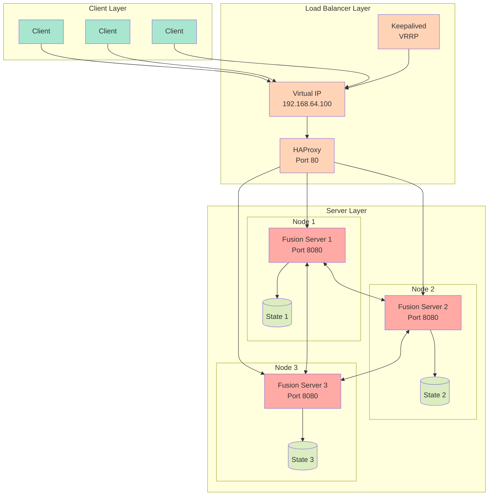

# Fusion Server

Fusion Server is a distributed configuration management system with high availability features, built using Go. It provides real-time configuration synchronization across multiple nodes with support for load balancing and failover.

## Features

- Distributed configuration storage with real-time synchronization
- High availability with HAProxy load balancing and Keepalived failover
- WebSocket support for real-time updates
- REST API for configuration management
- State persistence and recovery
- JSON import/export functionality
- Automatic HAProxy configuration management
- Health monitoring and debug capabilities

## Architecture

### Components

1. **State Management**
   - Distributed state synchronization across nodes
   - Version-based conflict resolution
   - Real-time state updates via WebSocket
   - Persistent storage of configuration data

2. **High Availability**
   - HAProxy load balancing across cluster nodes
   - Keepalived for VIP (Virtual IP) management
   - Automatic failover support
   - Dynamic backend server registration

3. **Networking**
   - Gossip-based cluster membership
   - WebSocket connections for real-time updates
   - REST API for configuration management
   - Health check endpoints

## Setup

### Prerequisites

- Linux environment
- HAProxy
- Keepalived
- Go 1.x or higher

### Installation

1. Clone the repository and build the server:
```bash
go build -o fusion-server
```

2. Configure the cloud-init file for node setup:
```yaml
#cloud-config
package_update: true
package_upgrade: true
packages:
  - haproxy
  - keepalived
```

3. Set up the required directories:
```bash
sudo mkdir -p /etc/haproxy
sudo mkdir -p /etc/keepalived
sudo mkdir -p /var/lib/fusion
```

### Configuration

1. **HAProxy Configuration**
   - Automatically generated based on cluster membership
   - Default configuration includes:
     - HTTP mode
     - Round-robin load balancing
     - Health checks on /getValue endpoint
     - Statistics page on port 8404
     - Configurable timeouts and connection limits

2. **Keepalived Configuration**
   - Virtual IP (VIP): 192.168.64.100
   - VRRP configuration for high availability
   - Automatic failover between nodes

3. **Node Configuration**
   - Each node requires:
     - Unique node name
     - Bind address and port
     - Optional join address for cluster membership

## Usage

### Starting a Node

```bash
./fusion-server --name <node-name> --addr <bind-address> --port <port> [--join <existing-node-address>]
```

### API Endpoints

1. **Configuration Management**
   - `POST /setValue` - Set a configuration value
   - `GET /getValue` - Retrieve configuration value(s)
   - `GET /ws` - WebSocket endpoint for real-time updates

2. **State Management**
   - `POST /upload` - Import configuration state
   - `GET /download` - Export configuration state

3. **Volume Control**
   - `POST /setVolume` - Update volume settings

### State Management

The system maintains a distributed state with the following features:
- Version-based conflict resolution
- Timestamp-based tie-breaking
- Real-time state synchronization
- Persistent state storage
- State verification and validation

## High Availability

### Load Balancing

HAProxy provides load balancing with:
- Round-robin distribution
- Health checks every 2 seconds
- Automatic backend server management
- Statistics monitoring

### Failover

Keepalived ensures high availability through:
- Virtual IP management
- Automatic master/backup failover
- VRRP protocol for IP takeover
- Quick failure detection

## Monitoring

1. **HAProxy Statistics**
   - Available at `http://<node-ip>:8404/`
   - Real-time server status
   - Connection statistics
   - Health check status

2. **Debug Mode**
   - Cluster state monitoring
   - Health check logging
   - State verification
   - Connectivity testing

## Security

- TLS support for secure communication
- WebSocket origin checking
- File permission management
- Proper service isolation

## Troubleshooting

1. **VIP Issues**
   - Check network interface configuration
   - Verify Keepalived status
   - Monitor VRRP advertisements

2. **Cluster Synchronization**
   - Check node connectivity
   - Verify gossip protocol communication
   - Monitor state version numbers

3. **Load Balancer Issues**
   - Check HAProxy configuration
   - Verify backend health checks
   - Monitor HAProxy logs

## Dependencies

- github.com/hashicorp/memberlist - Cluster membership and failure detection
- github.com/gorilla/websocket - WebSocket support
- Standard Go libraries

## Diagram

