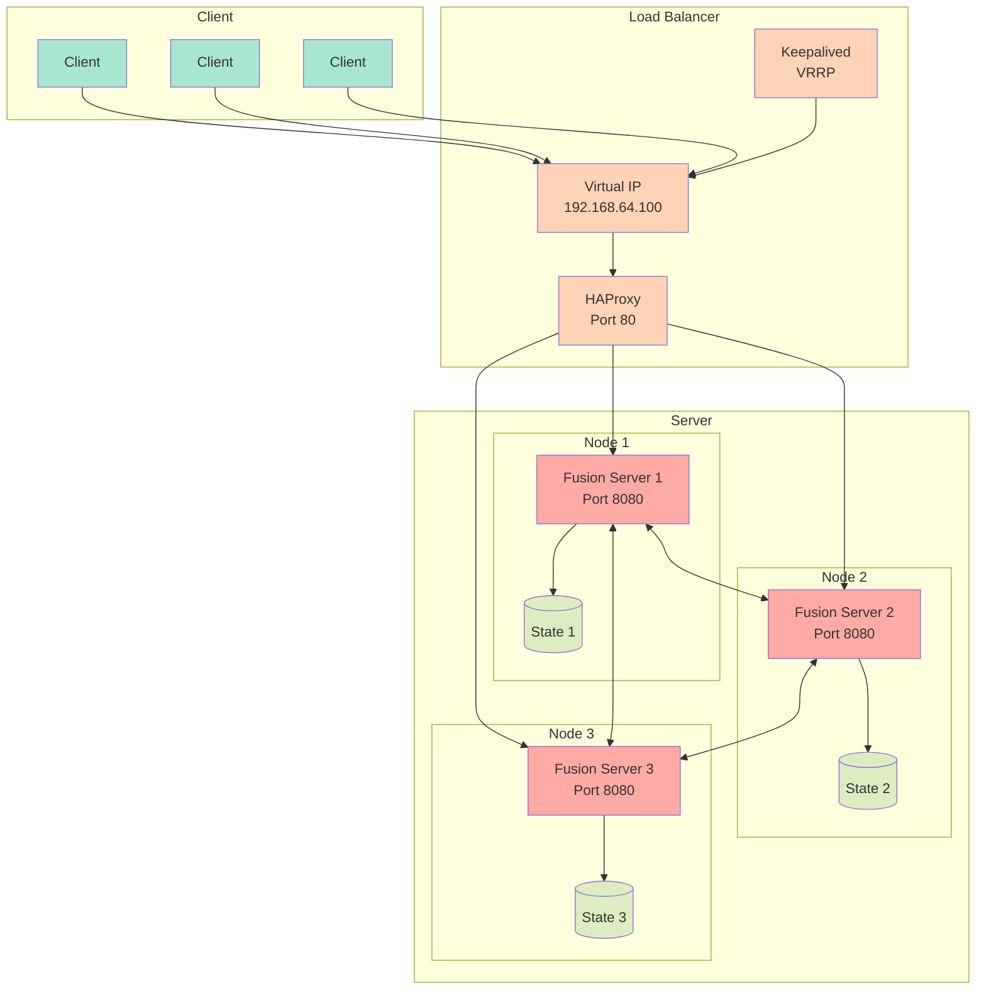

# Fusion Server

Fusion Server is a distributed configuration management system with high availability features, built using Go. It provides real-time configuration synchronization across multiple nodes with support for load balancing and failover.

## Features

- Distributed configuration storage with real-time synchronization
- High availability with HAProxy load balancing and Keepalived failover
- REST API for configuration management
- WebSocket support for streaming updates
- Unix Domain sockets for inter-network communication
- State persistence and recovery
- JSON import/export functionality
- Metrics monitoring and debug capabilities

## Architecture

### Components

1. **State Management**
   - Distributed state synchronization across nodes
   - Version-based conflict resolution
   - Persistent storage of configuration data
   - Timestamp-based tie-breaking
   - Real-time state synchronization
   - State verification and validation

2. **High Availability**
   - HAProxy load balancing across cluster nodes
   - Keepalived for VIP (Virtual IP) management
   - VRRP protocol for IP takeover
   - Automatic failover support
   - Dynamic backend server registration
   
3. **Networking**
   - Gossip-based cluster membership
   - REST API for configuration management
   - WebSocket and Unix socket connections for streaming updates
   - Unix Domain sockets for configuration management 
   - Metrics endpoints

### Configuration

   **HAProxy Configuration**
   - Automatically generated based on cluster membership
   - Default configuration includes:
     - HTTP mode
     - Round-robin load balancing
     - Health checks on /getValue endpoint
     - Configurable timeouts and connection limits

   **Keepalived Configuration**
   - Virtual IP (VIP): 192.168.64.100. The address to use is configurable in [multipass.env](multipass.env).
   - VRRP configuration for high availability
   - Automatic failover between nodes

   **Node Configuration**
   - Each node requires:
     - Unique node name
     - Bind address and port
     - Optional join address for cluster membership

### Dependencies

- [memberlist](github.com/hashicorp/memberlist) - Cluster membership and failure detection
- [websocket](github.com/gorilla/websocket) - WebSocket support
- [go](www.go.dev) - Standard Go libraries


## Setup

#### Multipass

[Multipass](https://multipass.run/) is used to create and manage Ubuntu VM instances for development and testing. It provides a quick way to spin up consistent Ubuntu environments across different platforms.

**macOS**
```bash
brew install --cask multipass
```

**Ubuntu**
```bash
sudo snap install multipass
```

**Windows**
- Download the installer from [Multipass website](https://multipass.run/download/windows)

## Installation

**Clone the repository and build the server**
```bash
git clone git@github.com:BoseProfessional/fusion-services.git
./build-fusion-server
```

## Usage
### Launch a single server instance
```bash
./launch
```

**Create multiple instances with default name "fusion"**
```bash
./launch --instances 3
```

### Stopping instances
**Stop instances with default name**
```bash
./launch --kill
```

**Stop multiple instances with prefix**
```bash
multipass stop fusion
```

**Stop instance with specific name**
```bash
multipass stop fusion1
```

### API Endpoints

1. **Configuration Management**
   - `POST /setValue` - Set a configuration value
   - `GET /getValue` - Retrieve configuration value(s)
   - `GET /ws` - WebSocket endpoint for real-time updates

2. **State Management**
   - `POST /upload` - Import configuration state
   - `GET /download` - Export configuration state

3. **Volume Control**
   - `POST /setVolume` - Update volume settings

### Set a single value
```bash
curl -X POST http://192.168.64.100:8080/setValue \
  -H "Content-Type: application/json" \
  -d '{"key": "value"}'
```

### Set a nested configuration object
```bash
curl -X POST http://192.168.64.100:8080/setValue \
  -H "Content-Type: application/json" \
  -d '{
    "volume" : {
      "min": "0.0",
      "max": 1.0,
      "current": 0.5
    }
  }'
```

### Get a specific value
```bash
curl "http://192.168.64.100:8080/getValue?key"
```

Response if value exists:
```json
{
  "exists": true,
  "value": {
    "current": 0.5,
    "max": 1,
    "min": "0.0"
  }
}
```

Response if value does not exist:
```json
{
  "error": "key not found",
  "exists": false
}
```

### Get all configuration values
```bash
curl http://192.168.64.100:8080/getValue
```

### Download current configuration state
```bash
curl -O http://192.168.64.100:8080/download
```

### Download and save with specific filename
```bash
curl http://192.168.64.100:8080/download > backup_config.json
```

## Websockets

### Simple connection that prints received messages
```bash
websocat ws://192.168.64.100:8080/ws
```

### Connect with interactive mode to send and receive messages
```bash
websocat -v ws://192.168.64.100:8080/ws
```

## Unix Domain Sockets
Unix Domain Sockets are used to communicate between server instances. The
socket is not public and can only be accessed within the internal network.

### Get all values
From with server instance:
```bash
echo '{"action":"get"}' | nc -u -w 1 localhost 7947
```

Outside of instance:
```bash
multipass exec fusion1 -- bash -c "echo '{\"action\":\"get\"}' | nc -u -w 1 -v localhost 7947"
```

### Set a value
```bash
echo '{"action":"set","test":"hello"}' | nc -u -w 1 localhost 7947
```

### Set a nested value
```bash
echo '{
  "action": "set",
  "audio": {
    "settings": {
      "volume": 0.6
    }
  }
}' | nc -u -w1 127.0.0.1 7947
```

### Set a value outside of instance
```bash
multipass exec fusion1 -- bash -c "echo '{
  "action": "set",
  "audio": {
    "settings": {
      "volume": 0.6
    }
  }
}' | nc -u -w1 127.0.0.1 7947"
```

## Basic Commands

1. **Create a new instance**
```bash
./launch
```

2. **List instances**
```bash
multipass list
```

3. **Start/Stop instances**
```bash
multipass stop fusion1
multipass start fusion1
```

4. **Access instance shell**
```bash
multipass shell fusion1
```

5. **Get instance information**
```bash
multipass info fusion1
```

6. **Mount local directory**
```bash
multipass mount /local/path fusion1:/home/ubuntu/mounted
```

7. **Delete instance**
```bash
multipass delete fusion1
multipass purge  # Remove deleted instances completely
```

#### Creating Multiple Nodes

For a three-node cluster setup:

```bash
# Create instances
./launch --instances 3

# Get IP addresses
multipass list

# Shell into instances
multipass shell fusion1
```

#### Useful Tips

1. **Transfer files to instance**
```bash
multipass transfer /local/file.txt fusion1:/home/ubuntu/
```

2. **Execute command in instance**
```bash
multipass exec fusion1 -- command
```

3. **View instance logs**
```bash
multipass exec fusion1 -- cat /var/log/cloud-init-output.log
multipass exec fusion1 -- sudo journalctl
multipass exec fusion1 -- sudo dmesg -w
multipass exec fusion1 -- sudo journalctl -u haproxy -f
multipass exec fusion1 -- sudo journalctl -u keepalived-server -f
multipass exec fusion1 -- sudo journalctl -u fusion-server -f
```
4. **Network configuration**
```bash
# Get instance IP address
multipass info fusion1 | grep IPv4
```

## Troubleshooting

1. **Instance fails to start**
   - Check cloud-init logs:
   ```bash
   multipass exec fusion1 -- cat /var/log/cloud-init-output.log
   ```
   - Verify resource availability on host machine
   - Ensure cloud-config.yaml is valid

2. **Network connectivity issues**
   - Verify host network connectivity
   - Check instance network status:
   ```bash
   multipass exec fusion1 -- ip addr
   ```
3. **systemd status**
```bash
multipass exec fusion1 -- systemctl status haproxy
multipass exec fusion1 -- systemctl status keepalived
multipass exec fusion1 -- systemctl status fusion-server
```

4. **VIP Issues**
   - Check network interface configuration
   - Verify Keepalived status
   - Monitor VRRP advertisements

5. **Cluster Synchronization**
   - Check node connectivity
   - Verify gossip protocol communication
   - Monitor state version numbers

6. **Load Balancer Issues**
   - Check HAProxy configuration
   - Verify backend metrics
   - Monitor HAProxy logs

## Testing

**Launch multiple instance**
```bash
./launch --instances 3
```
**Build and run test**
```bash
./run-tests
```
**Bruno**

Bruno is a free alternative to Postman and requires no account to use.

```bash
brew install bruno
```
- Launch /Applications/Bruno.app
- Import the Buron collection located at tools/api/fusion_api.json into Bruno
- Set the environmant to dev using the drop-down menu at the top-right of the Bruno window.


## Monitoring

**Metrics Server**
   - Available on configurable port (default: 9090)
   - Endpoints:
     - `/metrics` - Complete system metrics
     - `/cluster/status` - Detailed cluster information
   - Metrics include:
     - Cluster health and membership
     - Configuration state statistics
     - System resource usage
     - Network connectivity
     - Process health


#### Get Complete System Metrics
```bash
curl http://192.168.64.100:9090/metrics
```
Response includes:
- Timestamp
- Cluster metrics
- Node health
- Configuration state
- Network statistics
- Process metrics
- HAProxy status

#### Check Cluster Status
```bash
curl http://192.168.64.100:9090/cluster/status
```
Response includes:
- Member count
- Alive/suspect/dead nodes
- Cluster health percentage
- Node details
- Ping latency

#### Sample Metrics Output
```json
{
  "timestamp": "2024-11-08T12:00:00Z",
  "cluster": {
    "member_count": 3,
    "alive_count": 3,
    "local_node": "node1",
    "cluster_health": 100,
    "members": [
      {
        "name": "node1",
        "address": "192.168.64.101",
        "port": 7946,
        "state": "ALIVE"
      }
    ]
  },
  "node_health": {
    "status": "ALIVE",
    "uptime_seconds": 3600,
    "health_check_count": 720
  },
  "config_keys": 15,
  "websocket_clients": 3,
  "cpu_usage": 2.5,
  "memory_usage": 1048576,
  "goroutines": 25
}
```

### Monitoring Commands

1. **Check all metrics**
```bash
curl -s http://192.168.64.100:9090/metrics | jq
```

2. **Track cluster membership**
```bash
watch -n 1 'curl -s http://192.168.64.100:9090/cluster/status | jq .members'
```

3. **System resource usage**
```bash
curl -s http://192.168.64.100:9090/metrics | jq 'select(.cpu_usage, .memory_usage, .goroutines)'
```

### Diagram


