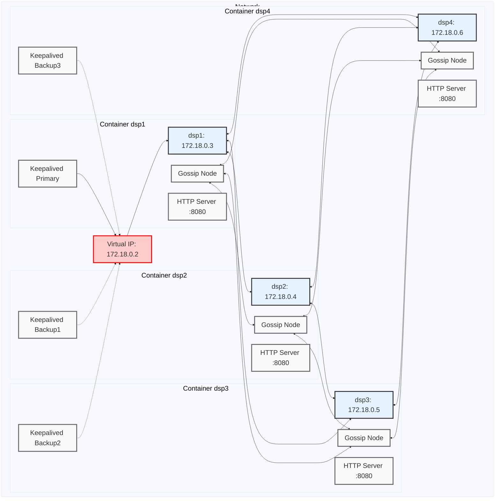

# Fusion High-Availability Gossip-Based Distributed System

## Architecture Overview
This project implements a high-availability, gossip-based distributed system using Docker containers. The system consists of multiple Data Service Provider (DSP) nodes that communicate using a gossip protocol, with a fault-tolerant setup for high availability.

## Components

### 1. DSP Nodes (dsp1, dsp2, dsp3, dsp4)
- Implemented using custom `fusion-gossip` image
- Communicate via gossip protocol for configuration sharing
- Each node listens on port 7946 for inter-node communication
- Nodes join the cluster automatically

### 2. HAProxy
- Used for load balancing
- Runs on each DSP node

### 3. Keepalived
- Manages high availability for the system
- Uses Virtual Router Redundancy Protocol (VRRP)
- Maintains a Virtual IP (VIP) that floats between DSP instances
- Automatic failover if the primary DSP fails

## Network Configuration
- Custom Docker network (likely in the 172.18.0.0/16 range)
- Each component has a static IP within this network
- Virtual IP (172.18.0.2) managed by Keepalived

## High Availability Features
1. **DSP Node Redundancy**: Multiple DSP instances ensure continuous service even if some nodes fail.
2. **Automatic Failover**: Keepalived automatically moves the Virtual IP to the healthy DSP instance.
3. **Gossip Protocol Resilience**: The gossip protocol allows the cluster to function and update even if some nodes are temporarily unavailable.

## Scalability
- Additional DSP nodes can be easily added to the cluster
- New nodes automatically join the gossip network

## Configuration Management
- Gossip protocol enables efficient propagation of configuration changes across all DSP nodes
- Changes made to any node are automatically disseminated to all other nodes in the cluster

## Monitoring and Health Checks
- Keepalived monitors the status of DSP processes
- Consider implementing additional monitoring for overall system health

## Getting Started
1. Ensure Docker and Docker Compose are installed on your system
2. Clone this repository
3. Set up the necessary configuration files (Keepalived configs for primary and backups)
4. Run `docker compose up -d` to start the system
5. Access the service via the Virtual IP (172.18.0.2) on the appropriate port

## Using curl to Set and Get Values

The DSP nodes expose an HTTP API on port 8080 for setting and retrieving configuration values. You can interact with this API using curl commands.

### Getting Key Values

To retrieve the current configuration from a DSP node:

```bash
curl http://localhost:9001/getValue
```

### Setting Key Values

To update a configuration value:

```bash
curl -X POST http://localhost:9001/setValue \
     -H "Content-Type: application/json" \
     -d '{"key": "example_key", "value": "new_value"}'
```

Replace `"example_key"` and `"new_value"` with your desired key and value.

### Uploading a JSON File
```bash
curl -X POST -H "Content-Type: application/json" -d @path/to/your/config.json http://localhost:9001/upload
```

### Uploading JSON data
```bash
curl -X POST -H "Content-Type: application/json" -d '{"key1": "value1", "key2": "value2"}' http://localhost:9001/upload
```

### WebSocket Connection
To establish a WebSocket connection:
```bash
websocat ws://localhost:9001/ws
```
This allows for real-time communication with the DSP nodes.

### Verifying Gossip Propagation

To verify that the configuration change has propagated to other nodes, you can get the configuration from another DSP:

```bash
curl http://localhost:8083/getValue
```

This should show the updated value for `"example_key"`.

Note: There might be a short delay before the change propagates to all nodes due to the nature of the gossip protocol.

## Testing Failover
To test the high availability setup:
1. Stop the primary DSP node: `docker compose stop dsp1`
2. Observe that the Virtual IP moves to another DSP node
3. Restart the primary: `docker compose start dsp1`
4. Verify that the system continues to function throughout this process

## Future Improvements
- Implement secure communication between nodes
- Add a service discovery mechanism for dynamic scaling
- Integrate with external monitoring and alerting systems
- Implement automated backup and restore procedures for configuration data

## Common Commands

### Build image
```
docker build -t fusion-gossip .
```

### Start images
```
docker compose up
```

### Stop single instance
```
docker compose stop dsp2
```

### Watch logs
```
docker compose logs -f
```

### Start single instance
```
docker compose start dsp2
```

### More drastic removal
```
docker compose rm -sf dsp2
```

### Recreate and start the service:
```
docker compose up -d dsp2
```

### Verify Keepalived status
```
docker compose exec dsp1 ip addr show eth0
```

### Simulate node failure
```
docker compose stop dsp1
```

### Check that the virtual IP has moved to another node
```
docker compose exec dsp2 ip addr show eth0
```

### Restart the first node and observe the cluster adjusting:
```
docker compose start dsp1
```


