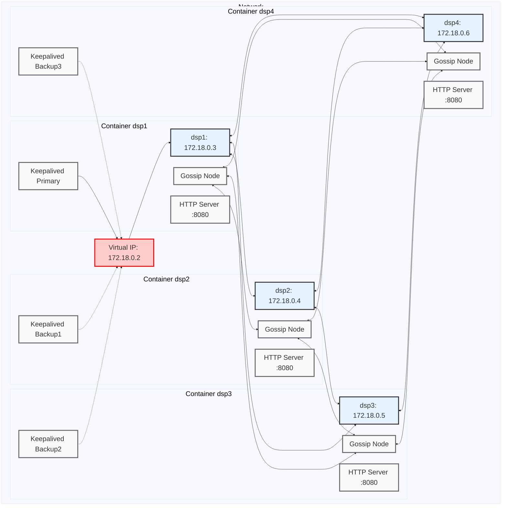

# Fusion High-Availability Gossip-Based Distributed System

## Architecture Overview
This project implements a high-availability, [gossip-based distributed](https://github.com/hashicorp/memberlist) system. The system consists of multiple servers that communicate using a gossip protocol, with a fault-tolerant setup for high availability.

## Components

### 1. Fusion Servers (fusion1, fusion2, fusion3, fusion4)
- Implemented using custom `fusion-server` service
- Communicate via gossip protocol for configuration sharing
- Each server listens on port 7946 for inter-server communication
- Server join the cluster automatically

### 2. [HAProxy](https://www.haproxy.org)
- Used for load balancing
- Runs inside each server

### 3. [Keepalived](https://www.keepalived.org)
- Manages high availability for the system
- Uses Virtual Router Redundancy Protocol (VRRP)
- Maintains a Virtual IP (VIP) that floats between DSP instances
- Automatic failover if the primary DSP fails

## Network Configuration
- Configured network in the 172.18.0.0/24 range
- Each component has a static IP within this network
- Virtual IP (172.18.0.2) managed by Keepalived

## High Availability Features
1. **Fusion Server Redundancy**: Multiple server instances ensure continuous service even if some servers fail.
2. **Automatic Failover**: Keepalived automatically moves the Virtual IP to the healthy DSP instance.
3. **Gossip Protocol Resilience**: The gossip protocol allows the cluster to function and update even if some servers are temporarily unavailable.

## Scalability
- Additional Fusion Server servers can be easily added to the cluster
- New servers automatically join the gossip network

## Configuration Management
- Gossip protocol enables efficient propagation of configuration changes across all fusion servers
- Changes made to any server are automatically disseminated to all other servers in the cluster

## Configuration Persistence
Configuration state is saved to /var/lib/fusion/config.json. The live data exists
in memory, but is serialized to disk. The serialized data is loaded from disk
when the server is initialized.

## Getting Started
1. Install Multipass on your system:
   ```bash
   # macOS
   brew install --cask multipass
   
   # Ubuntu
   sudo snap install multipass
   ```

2. Create the fusion instances using cloud-init:
   ```bash
   multipass launch --name dsp1 --cloud-init fusion-config.yaml
   multipass launch --name dsp2 --cloud-init fusion-config.yaml
   multipass launch --name dsp3 --cloud-init fusion-config.yaml
   multipass launch --name dsp4 --cloud-init fusion-config.yaml
   ```

3. Verify the instances are running:
   ```bash
   multipass list
   ```

4. Access the instances:
   ```bash
   multipass shell dsp1
   ```

## Using curl to Set and Get Values

The Fusion servers expose an HTTP API on port 8080 for setting and retrieving configuration values. You can interact with this API using curl commands.

### Getting Key Values
```bash
curl http://$(multipass info dsp1 --format json | jq -r '.info.dsp1.ipv4[0]'):8080/getValue
```

### Setting Key Values
```bash
curl -X POST http://$(multipass info dsp1 --format json | jq -r '.info.dsp1.ipv4[0]'):8080/setValue \
     -H "Content-Type: application/json" \
     -d '{"key": "example_key", "value": "new_value"}'
```

### Uploading a JSON File
```bash
curl -X POST -H "Content-Type: application/json" \
     -d @path/to/your/config.json \
     http://$(multipass info dsp1 --format json | jq -r '.info.dsp1.ipv4[0]'):8080/upload
```

### Setting volume, linear amplitude 0.0 - 1.0
```bash
curl -X POST -H "Content-Type: application/json" \
     -d '{"volume": 0.7}' \
     http://$(multipass info dsp1 --format json | jq -r '.info.dsp1.ipv4[0]'):8080/setVolume
```

### WebSocket Connection
To establish a WebSocket connection:
```bash
websocat ws://$(multipass info dsp1 --format json | jq -r '.info.dsp1.ipv4[0]'):8080/ws
```

## Testing Failover
To test the high availability setup:
1. Stop the primary Fusion server:
   ```bash
   multipass stop dsp1
   ```
2. Observe that the Virtual IP moves to another Fusion server
3. Restart the primary:
   ```bash
   multipass start dsp1
   ```
4. Verify that the system continues to function throughout this process

## Common Commands

### List all instances
```bash
multipass list
```

### Start instance
```bash
multipass start dsp1
```

### Stop instance
```bash
multipass stop dsp1
```

### Delete instance
```bash
multipass delete dsp1
```

### Purge deleted instances
```bash
multipass purge
```

### Access instance shell
```bash
multipass shell dsp1
```

### Execute command on instance
```bash
multipass exec dsp1 -- command
```

### View instance information
```bash
multipass info dsp1
```

### Mount local directory to instance
```bash
multipass mount /local/path dsp1:/instance/path
```

### Verify Keepalived status
```bash
multipass exec dsp1 -- ip addr show eth0
```

### Check instance logs
```bash
multipass exec dsp1 -- sudo journalctl -u fusion-server
```

## Future Improvements
- Implement secure communication between servers
- Add a service discovery mechanism for dynamic scaling
- Integrate with external monitoring and alerting systems
- Implement automated backup and restore procedures for configuration data


