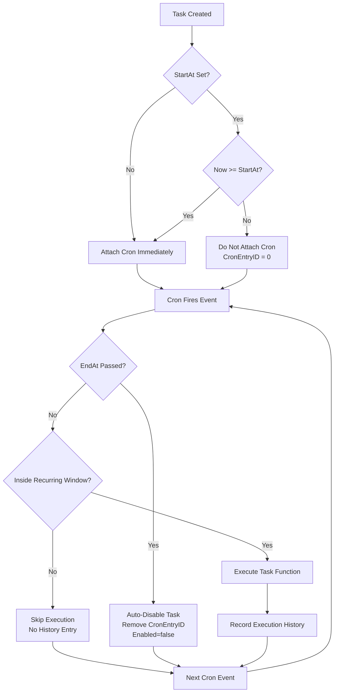

# TaskManager  
A deterministic, window-aware cron scheduler for Fusion Server

The **TaskManager** is the scheduling engine responsible for running timed tasks inside the Fusion Server.  
It manages creation, persistence, execution, enabling/disabling, and lifecycle rules for scheduled tasks.  
It supports cron expressions, optional time-window constraints (`StartAt`, `EndAt`), *recurring time windows*, snapshot activation tasks, and audio message playback tasks.

---

## Features

- Cron-based scheduling using **robfig/cron/v3** (standard **5-field** cron syntax)
- **Absolute time windows**
  - **StartAt** — delay scheduling until this time  
  - **EndAt** — auto-disable task after this time  
- **Recurring time windows**
  - Daily/weekly allowed execution periods  
  - Time-of-day windows (e.g., 09:00–17:00)  
  - Day-of-week restrictions (e.g., Mon–Fri)  
  - Overnight windows (e.g., 22:00–06:00)  
- Persistent task storage and execution history
- Periodic window-evaluation loop to attach/detach cron entries
- Panic-safe execution wrapper
- HTTP API for CRUD operations and task control
- Supports:
  - **Snapshot tasks** (activates stored snapshots)
  - **Message tasks** (trigger audio playback)
- Operates autonomously on each node; integrates with cluster snapshot system

---

# Cron Expression Support

The TaskManager supports **5-field** cron expressions:

```
MINUTE HOUR DOM MONTH DOW
```

Examples:

```
* * * * *        # every minute
*/5 * * * *      # every 5 minutes
0 8 * * 1        # every Monday at 08:00
15 10 * * *      # every day at 10:15
```

Seconds-based cron (`*/1 * * * * *`) is **not supported**.

---

# StartAt and EndAt Semantics

Absolute time windows define when scheduling becomes active or inactive.

### StartAt
- If unset → schedule immediately.  
- If in the future → task stays enabled but unscheduled (`CronEntryID = 0`).  
- Once StartAt passes → cron is attached.

### EndAt
- If unset → task never auto-disables.  
- If set → after EndAt passes:
  - Task auto-disables  
  - Cron entry removed  

### Combined Behavior

| StartAt | EndAt | Before StartAt | Between Window | After EndAt |
|---------|--------|----------------|----------------|--------------|
| unset | unset | scheduled | scheduled | scheduled forever |
| future | unset | not scheduled | scheduled | scheduled forever |
| unset | future | scheduled | scheduled | auto-disabled |
| future | future | not scheduled | scheduled | auto-disabled |

---

# Recurring Time Windows (Daily/Weekly)

A task may also define *recurring* allowable execution windows:

```json
"recurrence": {
  "start_time": "09:00",
  "end_time": "17:00",
  "days": [1,2,3,4,5]
}
```

### Supported behavior:
- Time-of-day window enforcement  
- Day-of-week restrictions (0=Sun…6=Sat)  
- Overnight windows (22:00–06:00)  
- Applies **in addition to** StartAt/EndAt  
- Checked at execution time inside `wrapTask`

Cron still determines *when attempts occur*; recurrence determines *whether they can execute*.

---

# Internal Architecture

### 1. Cron Scheduler
Schedules events based on cron expressions only.

### 2. Window Manager
Runs every 30 seconds:
- Attaches cron after StartAt  
- Removes cron after EndAt  

### 3. wrapTask Execution Wrapper
On each cron event:
- Skip before StartAt  
- Auto-disable after EndAt  
- Skip if outside recurring window  
- Execute task function if allowed  
- Recover from panics  
- Append execution history  

---

# Task Lifecycle

### Creation
- Validated and persisted  
- Cron attached based on StartAt

### Execution
- wrapTask enforces all window constraints  
- Records execution history

### Update
- Handles updated CronExpr, StartAt, EndAt, Recurrence  
- Re-schedules appropriately

### Disable / Enable
- Disable removes cron entry  
- Enable reattaches cron if inside window

---

# Persistence

TaskManager persists:
- Task definitions  
- StartAt / EndAt  
- Recurrence  
- Enabled/disabled state  
- Execution history (rotated)

CronEntryID is **not** stored and is rebuilt on startup.

---

# HTTP API Endpoints

| Method | Path | Description |
|--------|------|-------------|
| GET | `/tasks` | List tasks |
| POST | `/tasks` | Create task |
| GET | `/tasks/:id` | Retrieve task |
| PATCH | `/tasks/:id` | Update task |
| DELETE | `/tasks/:id` | Delete task |
| POST | `/tasks/:id/enable` | Enable task |
| POST | `/tasks/:id/disable` | Disable task |
| GET | `/tasks/history` | Retrieve execution history |

---

# Typed REST Contract

- `POST /tasks`
  uses `SnapshotTaskCreateRequest` for snapshot tasks.
- `PATCH /tasks/:id`
  uses `SnapshotTaskUpdateRequest` for snapshot tasks.
- `GET /tasks`
  returns `TaskListResponse`.
- `GET /tasks/:id`
  returns `Task`.
- `GET /tasks/history`
  returns `TaskHistoryResponse`.

Example snapshot task create request:

```json
{
  "id": "activate-snap-001",
  "cron_expr": "@every 2s",
  "description": "Change to analog input",
  "snapshot_id": "analog"
}
```

Example task list response:

```json
{
  "tasks": [
    {
      "id": "activate-snap-001",
      "description": "Change to analog input",
      "type": "TASK_TYPE_SNAPSHOT",
      "cron_expr": "@every 2s",
      "enabled": true,
      "scheduled": true,
      "snapshot": {
        "snapshot_id": "analog"
      }
    }
  ]
}
```

---

# Task Types

### Snapshot Task
```
"snapshot": { "snapshot_id": "<id>" }
```
Activates the specified snapshot.

### Message Task
```
"message": {
    "message_id": "<id>",
    "priority": 50,
    "zones": "all"
}
```
Triggers audio playback.

---

# Limitations

- Granularity = minutes  
- Window manager polling = 30s  
- Snapshot tasks require valid snapshot metadata  
- Node clocks must be synchronized  
- Missed events are not replayed  

---

# TaskManager Scheduling Flow (Mermaid Diagram)

This diagram visualizes the execution flow of the Fusion TaskManager:
- How StartAt, EndAt, and recurring windows interact with cron scheduling.
- How tasks are attached, skipped, executed, or disabled.
- How wrapTask enforces all window logic.


