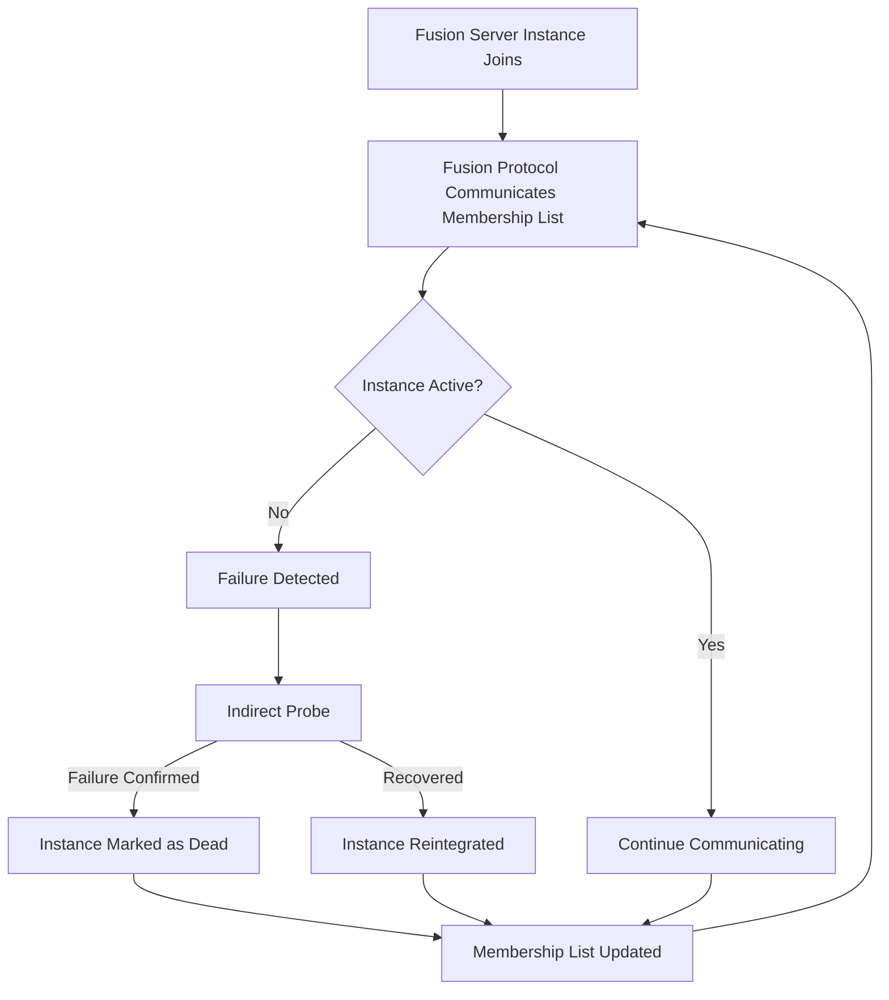

# Fusion Multi-Device Overview

## Overview
**Memberlist** is a Golang library that implements a **gossip-based membership protocol**, enabling multiple devices (nodes) to form a dynamic cluster without requiring a centralized service.

When multiple devices run **memberlist**, they maintain a list of active peers and automatically detect node failures, additions, and departures.

## How Devices Get Their IP Address
Devices typically determine their IP addresses in one of the following ways:

1. **Static Configuration**  
   - The node is manually assigned a static IP address in the system or configuration file.
   - Example: `192.168.2.100` is preconfigured for a node.

2. **DHCP (Dynamic Host Configuration Protocol)**  
   - The device requests an IP from a DHCP server, which assigns an available address dynamically.
   - Example: A device boots up, requests an IP from a router, and gets `192.168.1.50`.

## How Devices Report Their IP to Memberlist
Once a device has its IP, it reports it to **memberlist** in the following way:

### 1. Node Initialization
Each device creates a `memberlist.Config` struct and specifies its bind address (`BindAddr`).
   ```go
   config := memberlist.DefaultLANConfig()
   config.BindAddr = "192.168.1." // Use device's IP
   ml, err := memberlist.Create(config)
   if err != nil {
       log.Fatalf("Failed to create memberlist: %v", err)
   }
   ```
   
### 2. Joining the Cluster
- The device must **discover** other nodes already in the cluster.
- This is done via **manual configuration**, a **discovery service**, or a **predefined seed node list**.
   ```go
   existingNodes := []string{"192.168.1.10:7946", "192.168.1.20:7946"}
   _, err = ml.Join(existingNodes)
   if err != nil {
       log.Fatalf("Failed to join cluster: %v", err)
   }
   ```

### 3. Gossip Protocol Handles IP Distribution
- After joining, **memberlist’s gossip protocol** automatically disseminates the new node’s IP across the cluster.
- Each node maintains a table of **active nodes** with their IPs, statuses, and metadata.
- Gossip messages help nodes learn about each other without direct connections.

### 4. Node Announcements and Updates
- Periodically, memberlist nodes **exchange updates** to track:
  - New nodes joining
  - IP changes (in case of DHCP renewals)
  - Node failures (via heartbeat timeouts)

## Example Cluster Flow
1. Device A (`192.168.1.10`) starts and initializes `memberlist`.
2. Device B (`192.168.1.50`) gets an IP via DHCP and initializes `memberlist`.
3. Device B calls `Join(["192.168.1.10:7946"])`.
4. Device A and B exchange IPs via gossip.
5. If Device C joins later (`192.168.1.100`), it needs only one initial peer (A or B) to learn about the whole cluster.

## Failure Handling
- If a node becomes **unreachable**, other nodes detect the failure via **heartbeat timeouts**.
- If a node’s IP changes (e.g., DHCP renews), **memberlist updates its internal state** and propagates the change.
- The cluster remains operational as long as a majority of nodes remain active.

## Summary
- Devices get their IP via **static config or DHCP**.
- Each node initializes **memberlist** and sets its IP in `BindAddr`.
- The node **joins the cluster** by contacting an existing member.
- **Gossip protocol** distributes IPs dynamically across nodes.
- **Failure detection** ensures resilient membership tracking.

## Instance Membership Flow

