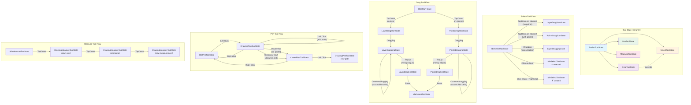

# Fusion Canvas State Flow
Open mermaid.live site to view the flow.

```mermaid
flowchart TB
    subgraph Tools["Tool State Hierarchy"]
        FusionToolState --> SelectToolState
        FusionToolState --> DragToolState
        FusionToolState --> PenToolState
        FusionToolState --> MeasureToolState
        DragToolState -.->|extends| SelectToolState
    end
    
    subgraph SelectTool["Select Tool Flow"]
        IST[IdleSelectToolState]
        IST -->|"TapDown on element\n(no points)"| LDS[LayerDragStartState]
        IST -->|"TapDown on element\n(with points)"| PDS[PointsDragStartState]
        IST -->|"Dragging\n(has selection)"| LDG[LayerDraggingState]
        IST -->|"Click on layer"| IST2[IdleSelectToolState\n✓ selected]
        IST -->|"Click empty / Right-click"| IST3[IdleSelectToolState\n✗ cleared]
    end
    
    subgraph DragTool["Drag Tool Flow"]
        direction TB
        Idle[Idle/Start State]
        
        Idle -->|"TapDown\non layer"| LDS2[LayerDragStartState]
        Idle -->|"TapDown\non element"| PDS2[PointsDragStartState]
        
        LDS2 -->|Dragging| LDG2[LayerDraggingState]
        LDG2 -->|"Continue dragging\n(accumulate delta)"| LDG2
        LDG2 -->|"TapUp\n(+snap adjust)"| LDE[LayerDragEndState]
        LDE -->|Reset| IST4[IdleSelectToolState]
        
        PDS2 -->|Dragging| PDG[PointsDraggingState]
        PDG -->|"Continue dragging\n(accumulate delta)"| PDG
        PDG -->|"TapUp\n(+snap adjust)"| PDE[PointsDragEndState]
        PDE -->|Reset| IST4
    end
    
    subgraph PenTool["Pen Tool Flow"]
        IPT[IdlePenToolState]
        IPT -->|"Left Click"| DPT[DrawingPenToolState]
        DPT -->|"Left Click\n(add point)"| DPT
        DPT -->|"DoubleTap\n(≥3 points)"| CPT[ClosedPenToolState]
        DPT -->|"Click near start\n(distance ≤10)"| CPT
        CPT -->|"Left Click"| DPT2[DrawingPenToolState\nnew path]
        DPT -->|Right-click| IPT
        CPT -->|Right-click| IPT
    end
    
    subgraph MeasureTool["Measure Tool Flow"]
        IMT[IdleMeasureToolState]
        IMT -->|TapDown| DMT1["DrawingMeasureToolState\n(start only)"]
        DMT1 -->|TapDown| DMT2["DrawingMeasureToolState\n(complete)"]
        DMT2 -->|TapDown| DMT3["DrawingMeasureToolState\n(new measurement)"]
    end
    
    style FusionToolState fill:#e1f5fe
    style SelectToolState fill:#fff3e0
    style DragToolState fill:#f3e5f5
    style PenToolState fill:#e8f5e9
    style MeasureToolState fill:#fce4ec
```