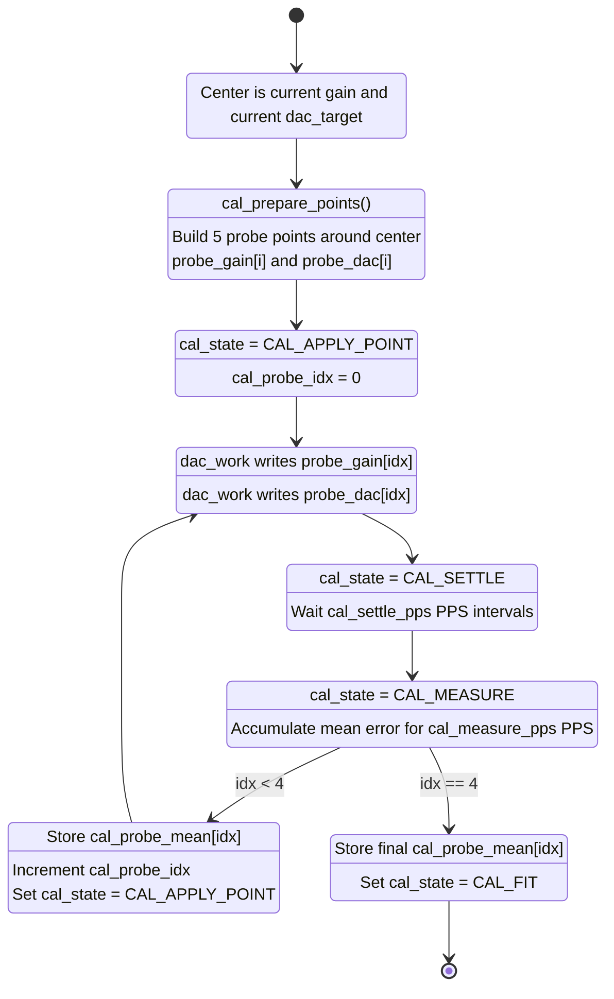
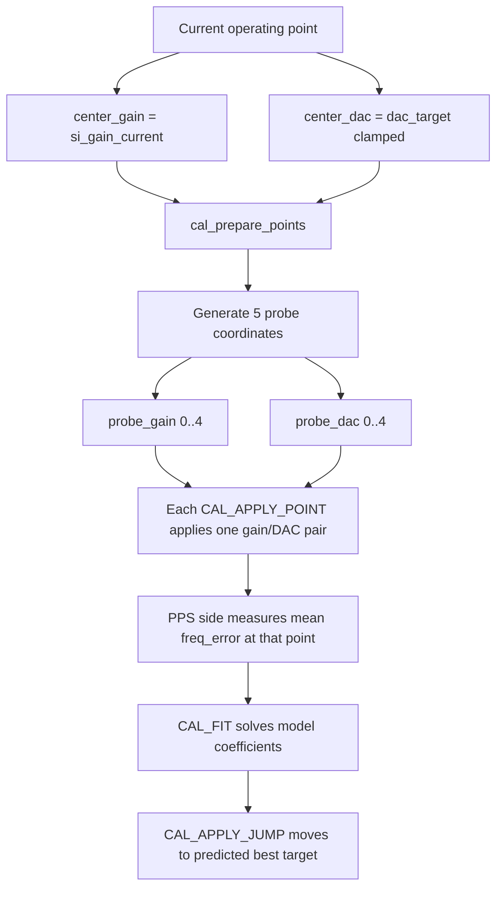
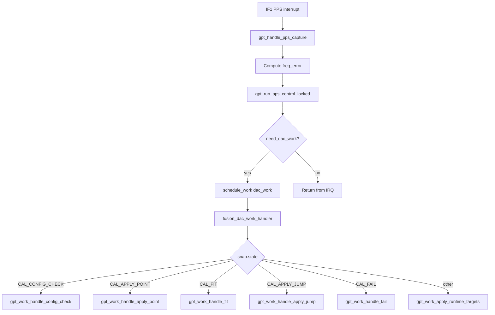

# Fusion GPT Disciplining State Machine

These diagrams separate the cooperating sides of the algorithm into smaller
blocks so they render more cleanly in the VS Code markdown preview.

The least obvious branch is the live-calibration path:

- `CAL_CONFIG_CHECK` does not itself calibrate anything.
- It decides whether a usable prebaked model exists.
- If not, it calls `cal_start_live_calibration_locked()`.
- That helper prepares a 5-point probe sweep around the current center gain/DAC.
- `CAL_APPLY_POINT` means "apply the next probe point from that prepared sweep".

- The PPS side, which runs from the IRQ path and advances timing/control state.
- The control side, which runs from `dac_work` and performs side-effecting I2C/file operations.

## PPS Side

```mermaid
stateDiagram-v2
  direction TB

  [*] --> WaitForPps

  WaitForPps --> CapturePps : IF1 interrupt
  CapturePps : Extend capture to 64-bit
  CapturePps : Update PPS/IF2 timing data
  CapturePps : Rebase PHC epoch
  CapturePps : Rephase OF1 if epoch valid

  CapturePps --> FirstPpsOnly : no previous PPS
  FirstPpsOnly --> WaitForPps

  CapturePps --> ComputeError : previous PPS exists
  ComputeError : diff = cap64 - prev_cap64
  ComputeError : freq_error = diff - 10,000,000

  ComputeError --> StartCalCheck : CAL_IDLE and !cal_config_checked
  StartCalCheck : Set cal_state = CAL_CONFIG_CHECK
  StartCalCheck : Request dac_work

  ComputeError --> EnterPrebake : CAL_IDLE and coeffs_valid
  EnterPrebake : Enter CAL_PREBAKE_WAIT

  ComputeError --> StartLiveCal : CAL_IDLE and !coeffs_valid
  StartLiveCal : cal_start_live_calibration_locked()
  StartLiveCal : Set cal_state = CAL_APPLY_POINT
  StartLiveCal : Request dac_work

  ComputeError --> PrebakeWait : CAL_PREBAKE_WAIT
  PrebakeWait --> PrebakeJump : fingerprint matches and target found
  PrebakeJump : Set cal_state = CAL_APPLY_JUMP
  PrebakeJump : Request dac_work

  PrebakeWait --> LiveCalRestart : fingerprint mismatch
  LiveCalRestart : cal_start_live_calibration_locked()
  LiveCalRestart : Set cal_state = CAL_APPLY_POINT
  LiveCalRestart : Request dac_work

  PrebakeWait --> CalFail : e0 timeout
  CalFail : Set cal_state = CAL_FAIL
  CalFail : Request dac_work

  ComputeError --> Settle : CAL_SETTLE
  Settle --> Measure : settle countdown expires
  Measure : Set cal_state = CAL_MEASURE

  ComputeError --> MeasureLoop : CAL_MEASURE
  MeasureLoop --> NextProbe : more probe points remain
  NextProbe : Set cal_state = CAL_APPLY_POINT
  NextProbe : Request dac_work

  MeasureLoop --> FitModel : final probe point complete
  FitModel : Set cal_state = CAL_FIT
  FitModel : Request dac_work

  ComputeError --> PiControl : !cal_active(cal_state)
  PiControl : Update dac_target using PI loop
  PiControl : Queue si_gain_target on DAC saturation

  EnterPrebake --> UpdateDiag
  PrebakeJump --> UpdateDiag
  LiveCalRestart --> UpdateDiag
  CalFail --> UpdateDiag
  Measure --> UpdateDiag
  NextProbe --> UpdateDiag
  FitModel --> UpdateDiag
  PiControl --> UpdateDiag
  StartCalCheck --> UpdateDiag
  StartLiveCal --> UpdateDiag
  PrebakeWait --> UpdateDiag : continue waiting
  Settle --> UpdateDiag : continue settling
  MeasureLoop --> UpdateDiag : continue measuring

  UpdateDiag : latest_freq_error / RMS / need_dac_work
  UpdateDiag : update discipline_ready under pps_lock
  UpdateDiag --> WaitForPps
```

## Control Side

```mermaid
stateDiagram-v2
  direction TB

  [*] --> Snapshot
  Snapshot : Read snap.state / targets / flags

  Snapshot --> ConfigCheck : snap.state == CAL_CONFIG_CHECK
  ConfigCheck : Load prebaked config file
  ConfigCheck : Optionally apply startup gain
  ConfigCheck --> PrebakeConfigured : coeffs_valid
  PrebakeConfigured : cal_enter_prebake_wait_locked()
  PrebakeConfigured --> [*]

  ConfigCheck --> LiveCalConfigured : missing / invalid / no coeffs
  LiveCalConfigured : cal_start_live_calibration_locked()
  LiveCalConfigured : prepares probe gains and probe DACs
  LiveCalConfigured : Set cal_state = CAL_APPLY_POINT
  LiveCalConfigured : Reschedule dac_work
  LiveCalConfigured --> [*]

  Snapshot --> ApplyPoint : snap.state == CAL_APPLY_POINT
  ApplyPoint : Write probe gain if needed
  ApplyPoint : Write probe DAC if needed
  ApplyPoint --> PointApplied : success
  PointApplied : Set cal_state = CAL_SETTLE
  PointApplied --> [*]
  ApplyPoint --> PointFail : I2C write failure
  PointFail : Set cal_state = CAL_FAIL
  PointFail : Reschedule dac_work
  PointFail --> [*]

  Snapshot --> Fit : snap.state == CAL_FIT
  Fit : cal_fit_model()
  Fit --> JumpReady : fit ok and residual acceptable
  JumpReady : Save prebaked config
  JumpReady : Set cal_state = CAL_APPLY_JUMP
  JumpReady : Reschedule dac_work
  JumpReady --> [*]
  Fit --> FitFail : degenerate fit / residual too high / no target
  FitFail : Set cal_state = CAL_FAIL
  FitFail : Reschedule dac_work
  FitFail --> [*]

  Snapshot --> ApplyJump : snap.state == CAL_APPLY_JUMP
  ApplyJump : Write jump gain if needed
  ApplyJump : Write jump DAC if needed
  ApplyJump --> JumpDone : success
  JumpDone : Set cal_state = CAL_DONE
  JumpDone --> [*]
  ApplyJump --> JumpFail : I2C write failure
  JumpFail : Set cal_state = CAL_FAIL
  JumpFail : Reschedule dac_work
  JumpFail --> [*]

  Snapshot --> Fail : snap.state == CAL_FAIL
  Fail : Set cal_state = CAL_DONE
  Fail : Reset integrator
  Fail --> [*]

  Snapshot --> RuntimeApply : any other state
  RuntimeApply : Apply dac_target if changed
  RuntimeApply : Apply si_gain_target if pending
  RuntimeApply : Clear baseline_restore_pending after reset replay
  RuntimeApply --> [*]
```

## Live Calibration Details

## Probe Sweep Meaning

## PPS to Control Hand-off

