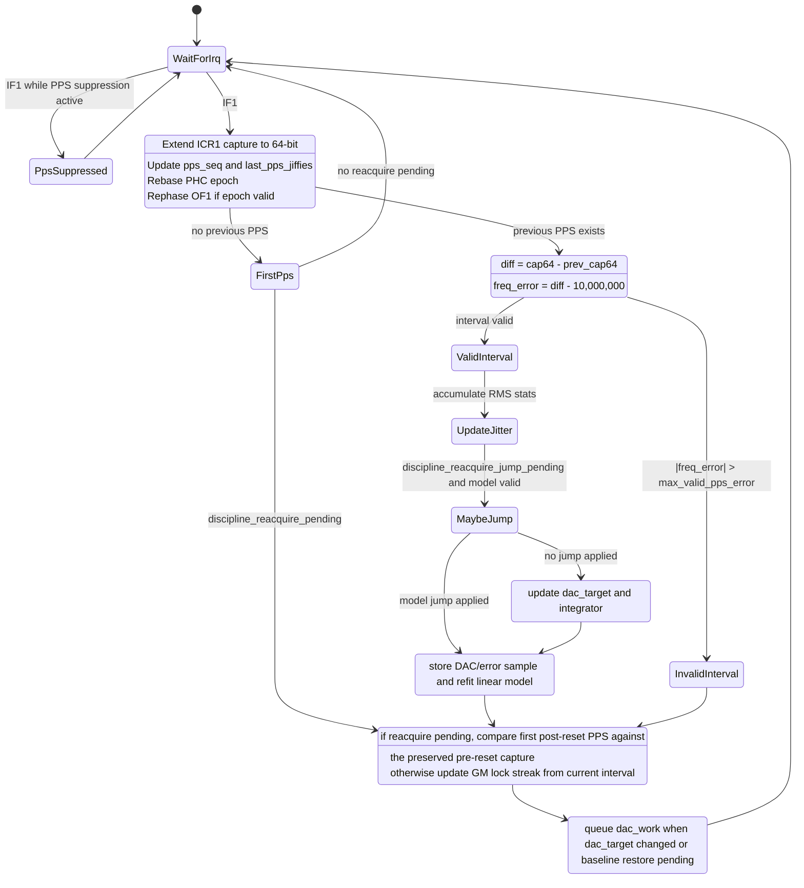
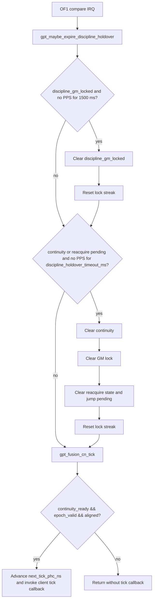
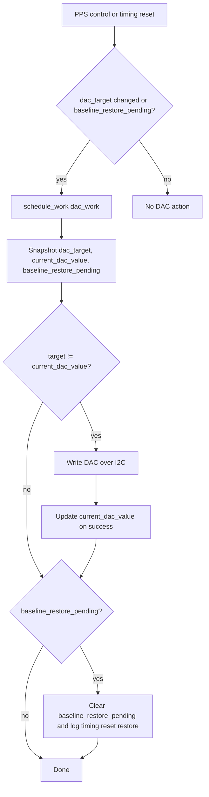

# Fusion GPT Timing And Discipline State Machine

This document describes the current timing and disciplining behavior in
`fusion_gpt_dr.c`.

The driver has three cooperating pieces:

- The IF1 PPS IRQ path updates capture history, PHC epoch state, servo state,
  and discipline readiness.
- The OF1 compare path advances the 1/3 ms tick timeline and expires holdover
  state when PPS has been missing for too long.
- `dac_work` performs the side-effecting DAC write outside the hard IRQ path.

## Timing Status Flags

- `discipline_continuity_ready`
  Means the local GPT timeline may continue running through short PPS loss or a
  timing reset. This is the broad "holdover continuity" flag.
- `discipline_gm_locked`
  Means recent valid PPS intervals have met the discipline threshold and the
  servo is currently considered locked to the grandmaster.
- `epoch_valid`
  Means a PPS edge has been bound to PHC time and the driver can map GPT ticks
  into PHC nanoseconds.
- `aligned`
  Means OF1 compare scheduling has been rephased from the most recent PPS edge.

Ticks are only delivered to the registered client when all of the following are
true:

- `discipline_continuity_ready`
- `epoch_valid`
- `aligned`

`discipline_gm_locked` is intentionally stricter than tick delivery. A short PPS
gap can clear GM lock while continuity remains true during holdover.

## Main PPS IRQ Path



## Discipline State Rules

- A valid PPS interval is one with `abs(freq_error) <= max_valid_pps_error`.
- `discipline_gm_locked` asserts after
  `DISCIPLINE_LOCK_CONSECUTIVE` consecutive valid intervals with
  `abs(freq_error) < error_thresh`.
- A valid interval with `abs(freq_error) >= error_thresh` clears
  `discipline_gm_locked` and resets the lock streak.
- Invalid PPS intervals are ignored by the normal servo and GM-lock logic.
  They do not immediately clear continuity.
- `discipline_continuity_ready` is asserted together with GM lock during normal
  acquisition and can then survive short PPS loss or a timing reset.

## Timing Reset And Reacquire Path

`fusion_gpt_reset_timing_state()` and `timing_reset_sim_trigger` clear the live
PPS/epoch/alignment state but can preserve continuity if the driver had a valid
pre-reset PPS anchor.

Two details matter here:

- The reset path preserves the actual `last_pps_jiffies` from before the reset,
  so holdover timeouts remain measured from the last real PPS edge.
- The first PPS after reset must validate continuity against the preserved
  pre-reset capture. If that interval is invalid or above `error_thresh`,
  continuity is dropped immediately.

```mermaid
flowchart TB
  A[Timing reset API] --> B[Snapshot previous state]
  B --> C[Remember pps_icr1_last64 and last_pps_jiffies]
  C --> D[Clear PPS valid, epoch valid, aligned, pending anchor]
  D --> E[Preserve DAC target for restore]
  E --> F{continuity was true and a real PPS capture existed?}

  F -->|no| G[Clear continuity and reacquire state]
  F -->|yes| H[Keep continuity true]
  H --> I[Keep preserved pre-reset PPS capture]
  H --> J[Restore previous last_pps_jiffies]
  I --> K[Set reacquire pending]
  J --> K

  K --> L[First PPS after reset]
  L --> M[Compute interval error against preserved pre-reset capture]
  M --> N{valid interval and |err| < error_thresh?}

  N -->|no| O[Clear continuity]
  O --> P[Clear GM lock and reacquire jump pending]

  N -->|yes| Q[Continuity preserved]
  Q --> R[GM lock remains false]
  R --> S[lock_streak = 1]
  S --> T[Reacquire model jump still eligible on next valid interval]
```

## OF1 Compare And Holdover Expiry

The OF1 compare interrupt runs every 1/3 ms. Before delivering the tick, it
checks whether PPS has been missing long enough to degrade or clear readiness.



## PHC Anchor Path

`fusion_gpt_set_phc_anchor(phc_ns_at_pps)` arms the next PPS edge as a PHC
anchor.

- The current local timeline is left running while the new anchor is pending.
- The next PPS edge latches `phc_epoch_ns` and `pps_epoch_cnt64`.
- That same PPS edge clears `pending_future_anchor` and forces OF1 to rephase,
  which re-establishes `aligned`.

This lets userspace queue a new PHC anchor without immediately blanking the
existing local timeline.

## DAC Work Path

The hard IRQ path only computes the target DAC. The actual I2C write happens in
`dac_work`.



## Practical Reading Of The State

- `continuity=0`, `gm_locked=0`
  No disciplined timing continuity is available. The client tick path is gated
  off.
- `continuity=1`, `gm_locked=0`
  Holdover is active or timing was just reset and continuity survived the first
  reacquire check. Ticks may continue if epoch and alignment are also valid.
- `continuity=1`, `gm_locked=1`
  The driver has recent good PPS intervals and is currently locked to the GM.
